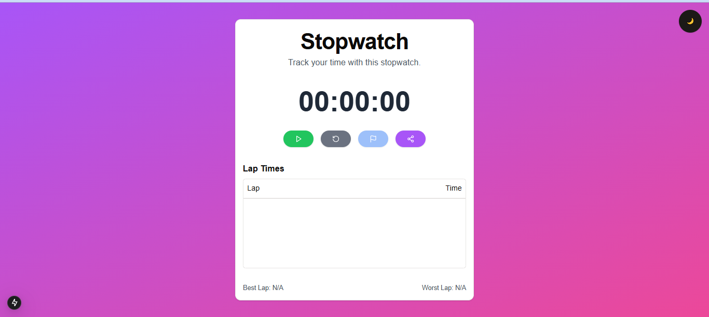
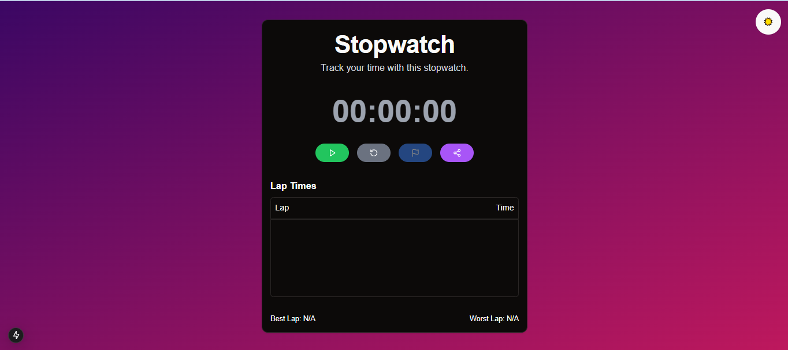

# ⏱️ Stopwatch App

A modern, interactive stopwatch app built with **Next.js**, **React**, **TypeScript**, **Tailwind CSS**, and **ShadCN UI Kit**. The stopwatch allows users to track elapsed time, record lap times, view their best and worst laps, and share their results. It includes smooth animations for laps using **Framer Motion** and a **dark mode** toggle for a visually customizable experience.

 
---

## 📋 Table of Contents

- [⏱️ Stopwatch App](#️-stopwatch-app)
  - [](#)
  - [📋 Table of Contents](#-table-of-contents)
  - [✨ Features](#-features)
  - [🛠️ Tech Stack](#️-tech-stack)
  - [🚀 Getting Started](#-getting-started)
    - [Prerequisites](#prerequisites)
    - [Installation](#installation)
  - [🎮 How to Use](#-how-to-use)
    - [Dark Mode](#dark-mode)
    - [Screenshots](#screenshots)

---

## ✨ Features

- **Start, Stop, and Reset**: Easily control the stopwatch to start, pause, or reset the timer.
- **Lap Tracking**: Record lap times and see each lap’s elapsed time.
- **Best and Worst Laps**: Highlights best and worst laps for quick insights.
- **Dark Mode Toggle**: Switch between light and dark themes for a comfortable viewing experience.
- **Animated Laps**: Smooth animations when laps are added or removed using Framer Motion.
- **Share Results**: Share total time, best lap, and worst lap with others using the Web Share API (on supported devices).
- **Responsive Design**: Built with Tailwind CSS, ensuring optimal display on any device.

---

## 🛠️ Tech Stack

- **[Next.js](https://nextjs.org/)** - A modern React framework for optimized web applications
- **[React](https://reactjs.org/)** - A JavaScript library for building interactive UIs
- **[TypeScript](https://www.typescriptlang.org/)** - A typed superset of JavaScript for scalable and maintainable code
- **[Tailwind CSS](https://tailwindcss.com/)** - A utility-first CSS framework for rapid styling
- **[ShadCN UI Kit](https://shadcn.dev/)** - A customizable UI component library for consistent design
- **[Framer Motion](https://www.framer.com/motion/)** - A React animation library for smooth transitions and effects

---

## 🚀 Getting Started

### Prerequisites

Ensure you have Node.js and npm installed:

```bash
# Node.js
https://nodejs.org/

# Check Node.js version
node -v

# Check npm version
npm -v
```

### Installation

1. **Clone the Repository**

   ```bash
   git clone https://github.com/Sheikh-Muhammad-Mujtaba/stop-watch_app.git
   cd stopwatch-app
   ```

2. **Install Dependencies**

   ```bash
   npm install
   ```

3. **Run the Application**

   ```bash
   npm run dev
   ```

   The application will be available at `http://localhost:3000`.

---

## 🎮 How to Use

1. **Start/Stop the Stopwatch**: Click the play button to start the timer and the pause button to stop it.
2. **Record Lap Times**: Click the flag button while the timer is running to record the current lap time.
3. **Reset Stopwatch**: Click the reset button to clear the timer and lap records.
4. **Dark Mode Toggle**: Toggle between light and dark mode for a personalized experience.
5. **View Best and Worst Laps**: The best and worst laps are highlighted in green and red respectively.
6. **Share Results**: Use the share button to share your results, including the best and worst laps, with others.

### Dark Mode

To toggle dark mode, a `dark` class is applied to the root `<div>`. Text colors and backgrounds are adjusted based on the current mode.

### Screenshots

- **Light Mode**

   
- **Dark Mode**

   
